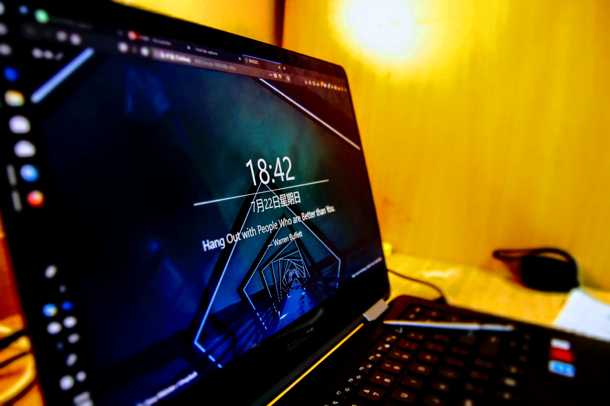

原来我在宿舍使用的是一台台式机，但是由于去南方医科大学交换，现实所迫，还是不得不购入一台笔记本。我个人对于笔记本的要求是：轻、性能够用、同时必须带一支笔，最好是 Wacom EMR 的笔（主动式的笔我试用过，不是特别好用，同学的 Surface ）以满足对数字绘画的要求。翻来覆去的在 [Reddit Stylus Wiki](https://www.reddit.com/r/stylus/wiki/index) 里寻找符合自己要求的，最终确定是 Samsung Notebook 9 Pro（wiki 里的信息有点过时，我手头上的 18 版为 i7 8550U + 16 G DDR4 内存），备选项为 Surface Book 2 / Surface Laptop，HP ZBook x2，Acer Switch 7 Black Edition
